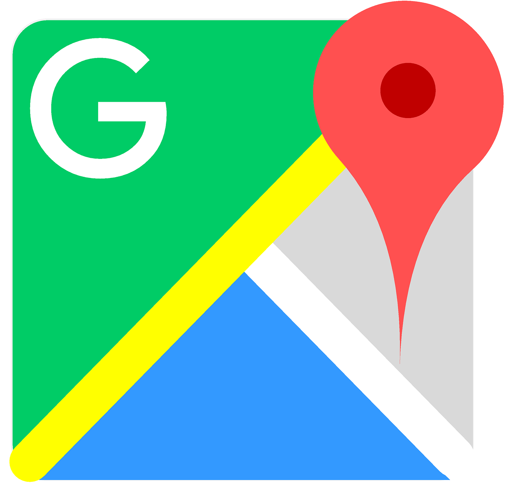

<!-- PROJECT LOGO -->
 

  

  <h3 align="center">DMT.GMap</h3>

  

    Great Maps for WPF and WinForms projects.
     
    <a href="https://github.com/dmtomczyk/greatmaps/"><strong>Explore the docs »</strong></a>
     
     
    <a href="https://github.com/dmtomczyk/greatmaps/">Report Bug</a>
  

<!-- TABLE OF CONTENTS -->

  
Table of Contents

  <ol>
    <li>
      <a href="#about-the-project">About The Project</a>
      <ul>
        <li><a href="#built-with">Built With</a></li>
      </ul>
    </li>
    <li>
      <a href="#getting-started">Getting Started</a>
    </li>
    <li><a href="#roadmap">Roadmap</a></li>
    <li><a href="#contact">Contact</a></li>
    <li><a href="#acknowledgements">Acknowledgements</a></li>
  </ol>

<!-- ABOUT THE PROJECT -->
## About The Project
This project is forked from https://github.com/radioman/greatmaps with the intent of adding additional capabilities and refactoring the source to support basic WPF functions like MVVM via improved data binding options.

### Built With

Major frameworks:
* [WPF](https://docs.microsoft.com/en-us/visualstudio/designers/getting-started-with-wpf?view=vs-2019#:~:text=Windows%20Presentation%20Foundation%20(WPF)%20is,binding%2C%20documents%2C%20and%20security.)
* [MVVMLight](https://github.com/lbugnion/mvvmlight)

<!-- GETTING STARTED -->
## Getting Started

1. Clone the repository
2. Open with Visual Studio 2017+
3. Build and run one of the demo projects

<!-- ROADMAP -->
## Roadmap

See the [open issues]() for a list of proposed features (and known issues).

<!-- CONTRIBUTING -->
## Contributing

1. Create your Feature Branch (`git checkout -b feature/AmazingFeature`)
2. Commit your Changes (`git commit -m 'Add some AmazingFeature'`)
3. Push to the Branch (`git push origin feature/AmazingFeature`)
4. Open a Pull Request

<!-- CONTACT -->
## Contact

Daymian Tomczyk - daymian.tomczyk@outlook.com

<!-- ACKNOWLEDGEMENTS -->
## Acknowledgements
* [CommonServiceLocator v2.0.4](https://www.nuget.org/packages/CommonServiceLocator/)

<!-- MARKDOWN LINKS & IMAGES -->
<!-- https://www.markdownguide.org/basic-syntax/#reference-style-links -->
